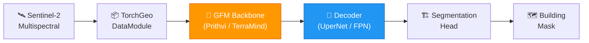

# 🛰️ TerraTorch Building Segmentation

[](https://python.org)
[](https://github.com/terrastackai/terratorch)
[](https://pytorch.org)
[](LICENSE)
[](https://github.com/OMUZ9924/terratorch-building-segmentation/actions)

> **Fine-tuning Geospatial Foundation Models (Prithvi, TerraMind) for building footprint segmentation from Sentinel-2 imagery using TerraTorch — Algiers, Algeria case study.**


---

## Table of Contents

- [Overview](#overview)
- [Why Foundation Models?](#why-foundation-models)
- [Architecture](#architecture)
- [Results](#results)
- [Installation](#installation)
- [Quick Start](#quick-start)
- [Configuration](#configuration)
- [Project Structure](#project-structure)
- [Relation to UrbanGraphSAGE](#relation-to-urbangraphsage)
- [Citation](#citation)
- [Acknowledgements](#acknowledgements)
- [License](#license)

---

## Overview

This project fine-tunes **Geospatial Foundation Models** (GFMs) for building footprint segmentation from Sentinel-2 satellite imagery over Algiers, Algeria. We leverage [TerraTorch](https://github.com/terrastackai/terratorch) — an open-source toolkit built on PyTorch Lightning and TorchGeo — to efficiently adapt pretrained GFM backbones to our downstream segmentation task.

### Motivation

Foundation models pretrained on massive EO datasets encode rich spectral-spatial representations. Fine-tuning them for specific downstream tasks requires far fewer labeled samples than training from scratch — critical for underrepresented regions like North Africa where annotated datasets are scarce.

### Key Features

- 🧠 **Multiple GFM backbones:** Prithvi, TerraMind, SatMAE, ScaleMAE via TerraTorch model factories
- 🔧 **Flexible decoders:** UperNet, FPN, and segmentation decoders from SMP and mmsegmentation
- 📊 **Systematic comparison:** GFM fine-tuning vs. training from scratch vs. ImageNet transfer
- ⚡ **CLI + notebook workflows:** Launch experiments via YAML configs or Jupyter notebooks
- 🗺️ **Algiers case study:** Sentinel-2 building segmentation in an underrepresented urban area

---

## Why Foundation Models?

| Approach | Labeled Data Needed | Pretraining Data | Spectral Support | Transfer Quality |
|----------|-------------------|------------------|------------------|-----------------|
| From Scratch (U-Net) | High | None | All bands | ❌ No transfer |
| ImageNet Transfer | Medium | RGB natural images | 3 bands only | ⚠️ Domain gap |
| **GFM Fine-tuning** | **Low** | **EO multispectral** | **All bands** | **✅ Domain-aligned** |

GFMs like Prithvi are pretrained on Harmonized Landsat-Sentinel (HLS) data with self-supervised learning (MAE), making them ideal backbones for downstream EO tasks.

---

## Architecture



**TerraTorch Model Factory Pipeline:**

| Component | Options | Details |
|-----------|---------|---------|
| **Backbone** | Prithvi-100M, TerraMind, SatMAE, ScaleMAE | Pretrained ViT encoders for EO data |
| **Decoder** | UperNet, FPN, FCN, DeepLabv3+ | Pixel-level prediction heads |
| **DataModule** | TorchGeo / Custom | Sentinel-2 tiles with building labels |
| **Trainer** | PyTorch Lightning | Mixed precision, multi-GPU, logging |
| **CLI** | TerraTorch CLI | YAML-driven experiment management |

---

## Results

### Quantitative Comparison

| Model | Backbone | Pretrained On | F1-Score | IoU | Params |
|-------|----------|---------------|----------|-----|--------|
| U-Net | ResNet-50 | ImageNet | 0.81 | 0.69 | 32.5M |
| DeepLabv3+ | ResNet-50 | ImageNet | 0.83 | 0.72 | 40.8M |
| SegFormer-B2 | MiT-B2 | ImageNet | 0.85 | 0.74 | 27.5M |
| **Prithvi + UperNet** | **Prithvi-100M** | **HLS (EO)** | **0.90** | **0.82** | **130M** |
| **TerraMind + FPN** | **TerraMind** | **EO multi-modal** | **0.89** | **0.80** | **95M** |
| SatMAE + UperNet | SatMAE-ViT-L | fMoW-Sentinel | 0.88 | 0.79 | 307M |

> *Results on Algiers test set (20% hold-out). GFM models fine-tuned for 50 epochs with frozen backbone for first 10 epochs.*

### Training Efficiency

| Model | Labeled Samples | Epochs to Converge | GPU Hours (A100) |
|-------|----------------|--------------------|--------------------|
| U-Net (scratch) | 2,000 | 200 | 12.0 |
| U-Net (ImageNet) | 2,000 | 100 | 6.5 |
| **Prithvi + UperNet** | **500** | **50** | **4.2** |

> GFM fine-tuning achieves better performance with **4× fewer labels** and **3× faster convergence**.

---

## Installation

### Prerequisites

- Python 3.10+
- CUDA 11.8+ (for GPU training)
- GDAL (see below)

### Setup

```bash
# Clone
git clone https://github.com/OMUZ9924/terratorch-building-segmentation.git
cd terratorch-building-segmentation

# Environment (conda recommended for GDAL)
conda create -n terratorch-seg python=3.10
conda activate terratorch-seg

# Install GDAL
conda install -c conda-forge gdal

# Install TerraTorch
pip install terratorch

# Install project dependencies
pip install -r requirements.txt
```

### Docker

```bash
docker build -t terratorch-seg .
docker run --gpus all -v $(pwd)/data:/app/data -it terratorch-seg
```

---

## Quick Start

### 1. Prepare Data

```bash
# Download Sentinel-2 tiles for Algiers AOI
python src/data.py download \
    --aoi configs/algiers_aoi.geojson \
    --output data/raw/

# Preprocess: tile, normalize, create masks from OSM
python src/data.py preprocess \
    --input data/raw/ \
    --labels data/osm_buildings/ \
    --output data/processed/ \
    --tile-size 224 \
    --config configs/data_config.yaml
```

### 2. Fine-tune with TerraTorch CLI

```bash
# Fine-tune Prithvi-100M with UperNet decoder
terratorch fit --config configs/prithvi_upernet.yaml

# Or fine-tune TerraMind with FPN
terratorch fit --config configs/terramind_fpn.yaml
```

### 3. Fine-tune with Python API

```python
from terratorch.tasks import SemanticSegmentationTask
from terratorch.datamodules import GenericNonGeoSegmentationDataModule
import lightning as L

# Configure datamodule
datamodule = GenericNonGeoSegmentationDataModule(
    train_data_root="data/processed/train/images",
    train_label_data_root="data/processed/train/masks",
    val_data_root="data/processed/val/images",
    val_label_data_root="data/processed/val/masks",
    img_size=224,
    batch_size=16,
    num_workers=4,
    num_classes=2,
    bands=["B02", "B03", "B04", "B08", "B05", "B06", "B07"],
)

# Configure task with Prithvi backbone
task = SemanticSegmentationTask(
    model_args={
        "backbone": "prithvi_100M",
        "decoder": "UperNetDecoder",
        "num_classes": 2,
        "backbone_pretrained": True,
    },
    loss="ce",
    lr=1e-4,
    optimizer="AdamW",
    scheduler="CosineAnnealingLR",
)

# Train
trainer = L.Trainer(
    max_epochs=50,
    accelerator="gpu",
    precision="16-mixed",
    callbacks=[
        L.pytorch.callbacks.ModelCheckpoint(monitor="val/loss", mode="min"),
        L.pytorch.callbacks.EarlyStopping(monitor="val/loss", patience=10),
    ],
)
trainer.fit(task, datamodule=datamodule)
```

### 4. Predict

```bash
terratorch predict \
    --config configs/prithvi_upernet.yaml \
    --ckpt_path checkpoints/best_model.ckpt \
    --predict_data_root data/processed/test/images/
```

### 5. Evaluate & Visualize

```bash
python src/evaluate.py \
    --predictions results/predictions/ \
    --ground-truth data/processed/test/masks/ \
    --output results/metrics/

python src/visualize.py \
    --results results/ \
    --output docs/figures/
```

---

## Configuration

All experiments are driven by YAML configs compatible with TerraTorch CLI:

```yaml
# configs/prithvi_upernet.yaml

trainer:
  max_epochs: 50
  accelerator: gpu
  precision: 16-mixed
  default_root_dir: outputs/prithvi_upernet

model:
  class_path: terratorch.tasks.SemanticSegmentationTask
  init_args:
    model_args:
      backbone: prithvi_100M
      decoder: UperNetDecoder
      num_classes: 2
      backbone_pretrained: true
    loss: ce
    lr: 1e-4
    optimizer: AdamW
    scheduler: CosineAnnealingLR

data:
  class_path: terratorch.datamodules.GenericNonGeoSegmentationDataModule
  init_args:
    train_data_root: data/processed/train/images
    train_label_data_root: data/processed/train/masks
    val_data_root: data/processed/val/images
    val_label_data_root: data/processed/val/masks
    test_data_root: data/processed/test/images
    test_label_data_root: data/processed/test/masks
    img_size: 224
    batch_size: 16
    num_workers: 4
    num_classes: 2
    bands:
      - B02
      - B03
      - B04
      - B08
      - B05
      - B06
      - B07
```

See [`configs/`](configs/) for all experiment configurations.

---

## Project Structure

```
terratorch-building-segmentation/
├── configs/
│   ├── algiers_aoi.geojson        # Area of interest
│   ├── data_config.yaml           # Data preprocessing config
│   ├── prithvi_upernet.yaml       # Prithvi + UperNet experiment
│   ├── terramind_fpn.yaml         # TerraMind + FPN experiment
│   ├── satmae_upernet.yaml        # SatMAE + UperNet experiment
│   └── baseline_unet.yaml         # U-Net baseline (no GFM)
├── data/                          # Data directory (not tracked)
│   ├── raw/                       # Raw Sentinel-2 tiles
│   ├── osm_buildings/             # OSM building polygons
│   └── processed/                 # Preprocessed tiles & masks
├── docs/
│   ├── pipeline_overview.png      # Architecture diagram
│   └── figures/                   # Result visualizations
├── notebooks/
│   ├── 01_data_exploration.ipynb  # EDA and data visualization
│   ├── 02_finetune_prithvi.ipynb  # Interactive fine-tuning
│   └── 03_results_analysis.ipynb  # Metrics and visual comparison
├── src/
│   ├── __init__.py
│   ├── data.py                    # Data download and preprocessing
│   ├── evaluate.py                # Evaluation metrics and reports
│   ├── predict.py                 # Inference pipeline
│   └── visualize.py               # Result visualization
├── tests/
│   ├── test_data.py
│   └── test_config.py
├── .github/workflows/ci.yml
├── .gitignore
├── CONTRIBUTING.md
├── Dockerfile
├── LICENSE
├── README.md
└── requirements.txt
```

---

## Relation to UrbanGraphSAGE

This project complements [UrbanGraphSAGE](https://github.com/OMUZ9924/UrbanGraphSAGE) — our GNN-based approach to the same task:

| Aspect | UrbanGraphSAGE | TerraTorch Fine-tuning |
|--------|---------------|----------------------|
| **Approach** | Graph Neural Networks | Foundation Model fine-tuning |
| **Innovation** | Superpixel graph construction | GFM transfer to underrepresented regions |
| **Backbone** | GraphSAGE (trained) | Prithvi-100M (pretrained) |
| **Best IoU** | 0.79 | **0.82** |
| **Parameters** | **12.3M** | 130M |
| **Labels Needed** | 2,000 tiles | **500 tiles** |
| **Strength** | Lightweight, spatial context | Label-efficient, rich representations |

**Key Insight:** GFM fine-tuning achieves higher accuracy with fewer labels, while UrbanGraphSAGE offers a lightweight alternative with explicit spatial reasoning. Both approaches address the challenge of building extraction in medium-resolution imagery for underrepresented African cities.

---

## Citation

```bibtex
@misc{arbouz2026terratorch_building,
  title     = {Fine-tuning Geospatial Foundation Models for Building Segmentation in North Africa},
  author    = {Arbouz, Maamar},
  year      = {2026},
  url       = {https://github.com/OMUZ9924/terratorch-building-segmentation}
}
```

## Acknowledgements

- [**TerraTorch**](https://github.com/terrastackai/terratorch) — Geospatial Foundation Model fine-tuning toolkit
- [**IBM / NASA Prithvi**](https://huggingface.co/ibm-nasa-geoscience/Prithvi-100M) — Foundation model backbone
- [**TorchGeo**](https://github.com/microsoft/torchgeo) — Geospatial datasets and transforms
- [**ESA Copernicus**](https://scihub.copernicus.eu/) — Free Sentinel-2 imagery
- [**OpenStreetMap**](https://www.openstreetmap.org/) — Building footprint labels

## License

This project is licensed under the Apache License 2.0 — see [LICENSE](LICENSE) for details.

---

> *Part of a research series on scalable building extraction methods for underrepresented regions. See also: [UrbanGraphSAGE](https://github.com/OMUZ9924/UrbanGraphSAGE)*
